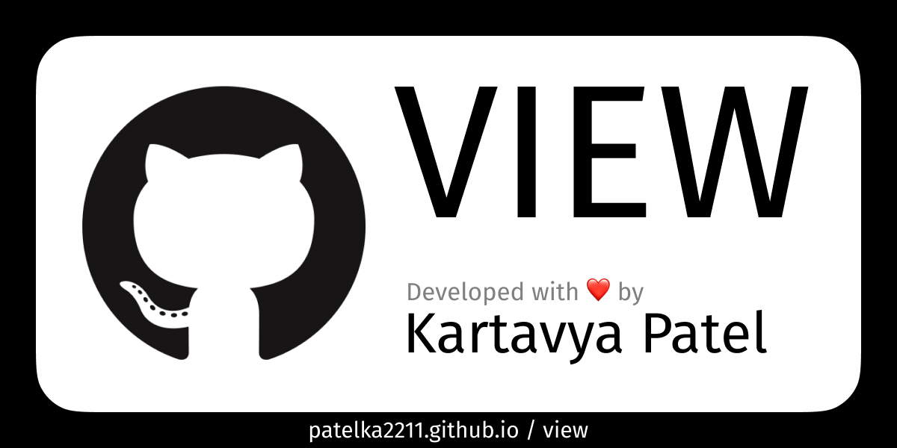

# view

-   to **view** information about GitHub users.

    

        <!--  -->
        
        

            github.com /
            <code>
            <a href="https://github.com/patelka2211/view" title="patelka2211/view on GitHub" target="blank_" style="cursor: pointer;">
                <a href="https://github.com/patelka2211" title="patelka2211 on GitHub" style="text-decoration: none;color: #58a6ff;" target="blank_">patelka2211</a> / <a href="https://github.com/patelka2211/view" title="patelka2211/view on GitHub" style="text-decoration: none;color: #58a6ff;" target="blank_">view</a>
            </a>
        </code>
        

    

---

# Description

It can be use to **view** GitHub profile of a particular user.

-   You can view
    -   About
    -   Repositories
    -   Starred repositories
    -   Followers and following users of a particular user.

# Examples

[patelka2211 / profile](https://patelka2211.github.io/view?uid=patelka2211)

[patelka2211 / repos](https://patelka2211.github.io/view?tab=repos&uid=patelka2211)

[patelka2211 / star](https://patelka2211.github.io/view?tab=star&uid=patelka2211)

[patelka2211 / social](https://patelka2211.github.io/view?tab=social&uid=patelka2211)

[patelka2211 / share](https://patelka2211.github.io/view?tab=share&uid=patelka2211)

# About languages

|                                                                Total used languages                                                                 |                                     Top language                                     |
| :-------------------------------------------------------------------------------------------------------------------------------------------------: | :----------------------------------------------------------------------------------: |
|  |  |

# License

&copy; 2022
<a href="https://github.com/patelka2211" title="Kartavya Patel" style="margin-left: 5px;">Kartavya Patel</a>

